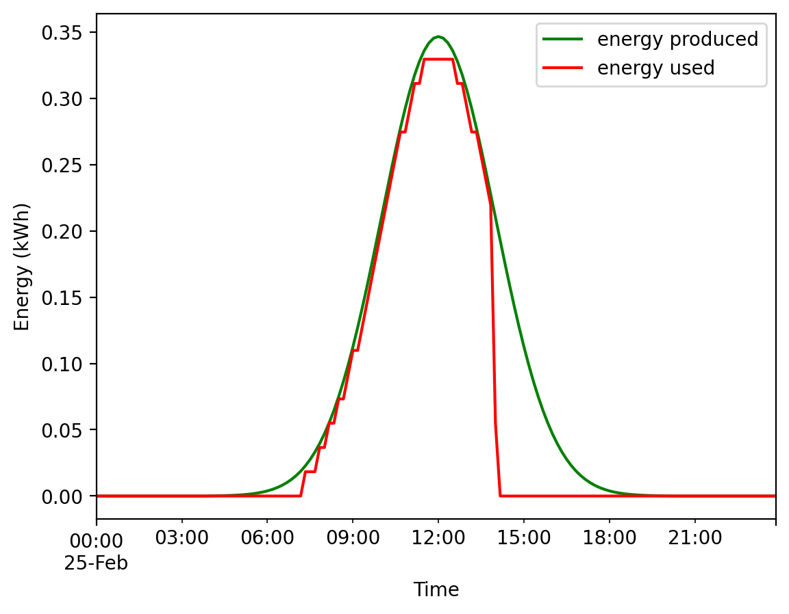

# Magnes.ie
## Orchestrator execution simulations

### Information
This file presents results of a simulation of the Magnes.ie orchestrator over a period of 24h.
These simulations were entirely run within the Orchestrator and have the only purpose of demonstrating the ability of the orchestrator to run jobs based on available green energy.

Considering:
- I a time interval,
- P the quantity of energy produced over the last 10 minutes,
- U the quantity of energy used over the last 10 minutes.

The orchestrator must validate the following rule: 

    ∀ t ∈ I, P(t) ≥ U(t)

#### Hardware considerations
We based the simulations on the following assumptions: 
- 48 available nodes running with 2 **Intel Xeon E5-2630L v4** CPUs,
- 2 solar panels producing 5 kWh per day each, for a total of 10 kWh over the whole simulation.

##### Jobs types
To run these simulations, we used two types of simulated jobs:
- Short jobs: with 10 photos,
- Long jobs: with 30 photos.

#### Implementation 
Each iteration of the program's main loop makes the simulation advance by 10 minutes, from 00:00 to 23:50.

The Mocked Photogrammetry Service (MPS) keeps the list of jobs sent by the orchestrator and keeps them in a running state based on the number of photos of the jobs. We associated 1 photo with 1 minute of runtime. A short job then runs for 10 minutes, and a long one for 30 minutes.

The mocked photogrammetry service simulates multiple nodes by running multiple jobs at the same time, up to 48.

The energy produced follows a gaussian curve. We used a 10 kWh total production for the 24h simulations, based on regular solar panels.

The energy used is based on the nodes' CPUs (55 W each -> 0.0183 kWh for 10 minutes). Each CPU is assumed to be always used at maximum power by the photogrammetry service.

---
### Simulations
#### Simulation 1
Simulated jobs: 
- Short: 450,
- Long: 0,
- Total complexity: 450 × 10 = **4500**.

Result:

---
#### Simulation 2
Simulated jobs:
- Short: 0,
- Long: 150,
- Total complexity: 150 × 30 = **4500**.

Result:

---
#### Simulation 3
Simulated jobs:
- Short: 225,
- Long: 75,
- Total complexity: 225 × 10 + 75 × 30 = 2250 + 2250 = **4500**.

Result:

### Conclusion
We can see the curve of used energy stays below the curve of produced energy, which validates the experience's requirement. 

Besides, the 3 results are fairly similar, which makes perfect sense considering that: 
- the 3 payloads were identical regarding the total duration of the simulations (and so were the simulations' times),
- We based the amount of used energy on the number of nodes used by the simulation, which is the same for short jobs and long jobs.

